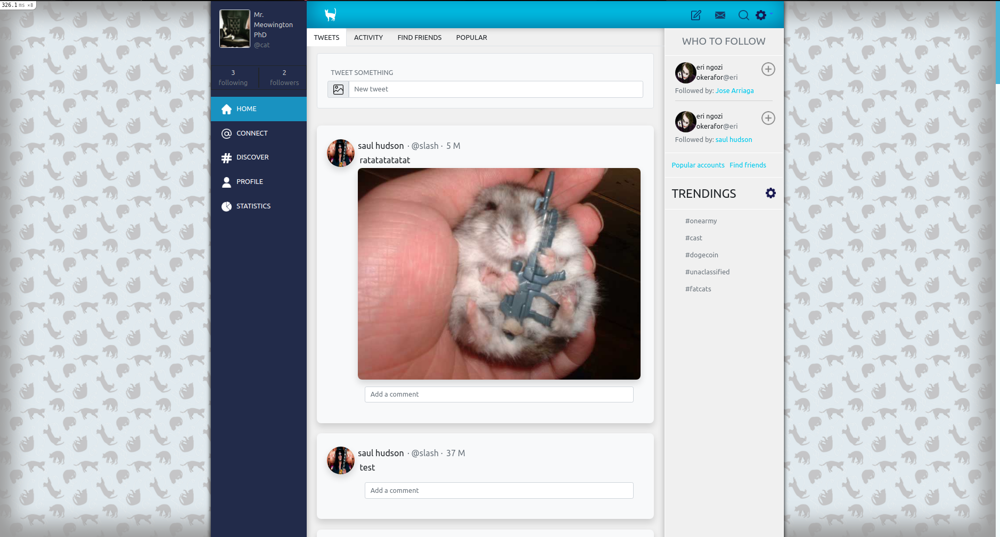

# README


### TWITTER

This project is a clone of Twitter with the design of [Gregoire Vella](https://www.behance.net/gallery/14286087/Twitter-Redesign-of-UI-details). 



The project contains a user log-in page and 'follows user' system, allowing the user to follow other users and see their posts, also each profile shows each user's amount of posts, followers, and users that person is following.


The main page allows you to see all the posts from the users you are following and, also includes a panel where you can see people you may be interested to follow.


The menu is always present on all pages except for the login and signs in ones, the menu includes a home page, a connect page where you can find other users, a discover page where you can find posts from people you don't follow, a profile where you can see your profile and a statistics page that is not working at the moment.

The top menu bar contains the write new post, message icon, find icon, and options but only the options one is working at the moment, here you can log out of your account or edit your account.


The edit account options include the banner and profile picture.
The post sections are shown either on the home or on each profile, with the difference that each profile will only show the posts from that user, each post allows you to post text and images, at the moment you can only upload one image per post.
Each post has the option to have multiple comments from different users.

### Live Version

- [Link to live version](https://secure-springs-89314.herokuapp.com/)


### Prerequisites

- Windows, Mac or Linux machine 

- Web browser other than Internet Explorer

- Postgreess instaled and set it up [see how](https://www.digitalocean.com/community/tutorials/how-to-install-postgresql-on-ubuntu-20-04-quickstart)

​
## Getting Started

To get a local copy up and running follow these simple example steps.

- First you need to fork the repository [twitter](https://github.com/JAAR91/twitter)

- Copy the ssh using the green code button

- Then you clone the repository to your pc using, the command on your terminal:

```
git clone 'ssh code  you copy early'
```

### Setup

Install gems with:

```
bundle install
```

Then use the following code on your terminal:

```
run yarn install
```

or 

```
npm install
```

Setup database with:

```
   rails db:create
   rails db:migrate
```

### Usage

Start server with:

```
    rails server
```

Open `http://localhost:3000/` in your browser.


### Build With

- Ruby 
- Rails
- SQL


👤 **Author**

👤 **Jose Alberto Arriaga Ramos**

- GitHub: [@jaarkira](https://github.com/jaarkira )

- Twitter: [@91_jaar](https://twitter.com/91_jaar )

- LinkedIn: [Jose Arriaga](https://www.linkedin.com/in/jaar/)
​

## 🤝 Contributing

Contributions, issues, and feature requests are welcome!

## Show your support


Give a ⭐️ if you like this project!


## Acknowledgments

- Microverse ( https://www.microverse.org/ )

## 📝 License

​
 
© 2021 GitHub, Inc.
Terms
Privacy
Security
Status
Docs
Contact GitHub
Pricing
API
Training
Blog
About